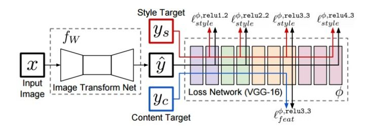
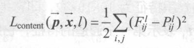
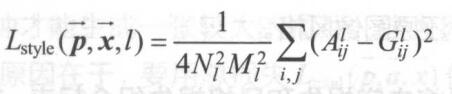
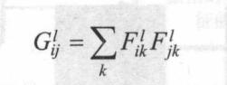

[注] 这个文档对项目进行一些细节的说明
-----------------------------
谈一谈写项目时，项目的具体实现的原理，遇到的问题与解决的思路。

什么是图像风格迁移
-----------------------------
在上一个README文件中，相信大家已经明白了什么是图像风格迁移。通俗地说：所谓的图像风格迁移就是利用神经网络将一张图片的风格元素应用到另一张图片上。

图像风格迁移的原理
------------------------------
首先，图像风格迁移是基于迁移学习的，迁移的模型是VGG16。VGG16网络是由卷积层和全连接层构成的，卷积层的作用是提取图像的特征，全连接层的作用是将这些特征通过计算概率的方式映射到相应的分类上。

图像风格迁移利用了VGG net的卷积层提取图像的信息，具体分析如下：

* 在VGG net中，不同的卷积层提取到的信息是不一样的，例如，conv1、 conv2等，这些浅层的卷积提取的都是一些简单的特征(比如，水平和垂直物体的检测，图像亮度的检测等)。而VGG net中深层次的卷积，如conv5、 conv6等，这些卷积则可以提取到更深层次的特征(如猫狗的识别，人脸的识别)

*  图像风格迁移最重要的两部分特征为：内容 和 风格。所以，我们需要利用Vgg net 把传入图像的内容和风格的特征图提取出来。Vgg net中，浅层的卷积对简单特征比较敏感，所以可以用浅层卷积网络提取图像的颜色、纹理等特征。Vgg 深层卷积提取的信息对整体特征更为敏感，所以可以利用深层卷积提取图像的内容特征。

图像风格迁移的网络结构
----------------------

由图可见，整个神经网络由两部分构成：图像生成网络和Vgg net。
图像生成网络的结构为：
1. 三层卷积网络
1. 五个residual结构
1. 反卷积

基本的工作流程为：
1. 图像生成网络生成一个图像。
2. 通过Vgg net和梯度下降算法，使得生成的图像在内容上与原始图片相同，而风格与风格图片相似。

损失函数
----------------------------
损失函数由两部分构成：
#### 1. 内容损失
* 内容损失,是指内容图像与生成图像在内容上的损失，具体如下：

* 生成图像与内容图像都被送入Vgg net，经过特定的卷积层后的得到相应的特征图，利用特征图的差异来表示两幅图像在内容上的差异。
* 1. 公式中的p和x分别表示n内容图像和生成图像。
  2. l 表示不同的卷积层。
  3. i 表示特征图的通道
  4. j 将一张特征图展成一维向量后对应位置（高和宽）的具体值。
#### 2.风格损失
* 风格损失，是指风格图像与生成图像在风格上的差异，具体如下：

* 同样的，生成图像与内容图像也是被送入到Vgg net网络，经过卷积得到特征图，通过特征图计算损失。但是，这里的风格损失计算和上面的内容损失函数不一样。风格损失是基于Gram矩阵计算的。
* Gram 矩阵：

* gram 矩阵的计算是将一个通道与其他通道的对应的矩阵相乘得到的一个矩阵。
* 通过计算gram矩阵之间的差异来衡量风格的损失。
* 公式前的系数是一个归一化项,目的是防止风格损失的数量级相比内容损失过大。

神经网络的训练
-----------------------
训练的过程肯定是一个复杂、揪心、反复调整的过程。同时也需要更好的硬件来支持(GTX 1080 Ti)下面说一下训练时的细节：
1. 训练的数据集是Microsoft的CoCo数据集(大才小用)
2. 损失函数的构成为内容损失和风格损失，内容损失和风格损失的超参数的调整也是一个问题，让损失函数受内容损失的影响大还是风格损失的影响大，这是一个见仁见智的问题，对于不同的风格图片的训练，都会有不同的超参数得到不同效果的情形，所以没有绝对固定的参数，能使效果更好的参数一定是更好的参数。
3. 内容和风格损失的损失基于Vgg net的哪些卷积层也是一个可以变动的参数，虽然有深层和浅层之分，但是不论是深层还是浅层也有很多不同可以选择的层数。多选择几个浅层和深层，并取他们的平均值作为损失函数可能会好一点。
2. 说到训练就可能不会避免欠拟合和过拟合，我在项目里的网络结构中加上了Instance normalization 结构进行归一化减少过拟合。
5. 训练的过程还会遇到内容损失下降，但是风格损失上升的情况，有时候，也会遇到风格损失下降但是内容损失上升的情况。对于这种情况，说明训练不够彻底，继续训练一般就可以解决问题了。

项目结构
---------------------------
| 文件名    | 功能 |
|:---:|:-----:|
| conf    | 文件夹中训练模型时的配置文件，包含原始图像风格图像的位置、各个损失的系数、最大训练步数等 |
|  nets 与processing  | 加载Vgg16 以及进行图片的处理 |
|  losses.py   | 损失函数的定义 |
| models.py    | 网络结构的定义 |
|  reader.py   | 读取图片的程序 |
|  train.py   | 训练的程序 |
|  剩下的文件   | FLask web程序 |

web端的构建实现时的插曲
----------------------------
web端是使用flask开发的，仅仅是一个展示界面，没有其他的功能(QAQ)
web 实现的时候也遇到了好多问题，下面具体谈一谈哈：
#### web 端怎么调用神经网络？
其实，这个问题也一直是构建网络时我思考的问题，我实现的方法是在web程序里直接调用神经网络的生成过程，等到生成图片后再返回显示图片。在Flask中，我直接定义一个可以调用神经网络的函数，通过在函数里建立Session会话执行神经网络。
但是这并不是这么简单的，神经网络调用过程是需要参数的，例如传入的图像，模型文件等，怎么在web端把这些参数传入神经网络是一个问题。我解决的思路是：
1. 对于传入的图片，我通过表单把传入的图像保存到web缓存里，再通过Request对象拿到图像，这样就解决了上传图像的问题。
2. 对于模型文件的调用问题，这个比较复杂。因为我们有七个不同的风格图片对应的风格模型文件，如何让用户能够选择转换的风格类型 与 模型文件对应起来成了一个棘手的问题。我解决的思路是：用户可以通过web表单的下拉列表选择模型文件，同时我们就可以通过Request对象获取到用户选择的哪一个文件，再把模型文件的路径与相应的下拉列表的选项通过字典对应起来，这样用户一旦选择了风格图片，我们就得到了相应模型文件的路径，这样，模型文件就可以对应起来了。